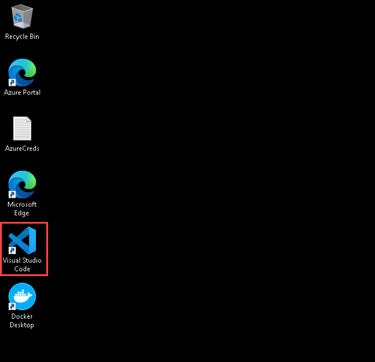

## Exercise 1: Set up repo and personal access token

Duration: 30 minutes

### Task 1: Create the Project Repo

In this task, you will create an account in **GitHub** and use `git` to add lab files to a new repository.

1. In a new browser tab navigate to the below URL and Log in with your personal GitHub account.

   ```
   https://www.github.com
   ```
    > **Note** : You have to use your own GitHub account. If you don't have a GitHub account then navigate to the following link ```https://github.com/join``` and create one.
    
1. In the upper-right corner, expand the user drop down menu and select **Your repositories**.

   

1. Next to the search criteria, locate and select the **New** button.

   

1. On the **Create a new repository** screen, name the repository ```mcw-continuous-delivery-lab-files```, select **Private** and click on **Create repository** button.

   
   
   >Note: If you have done this lab previously you may have the repository already created in your GitHub account, Please make sure to delete the Repo and create a new one. 

1. On the **Quick setup** screen, copy the **HTTPS** GitHub URL for your new repository, and paste this in notepad for future use.

   

1. From the VM desktop, double click on the **Visual Studio Code** desktop icon to open the application.

   
   
1. In Visual Studio Code application, select **Terminal** **(1)** and click on **New Terminal** **(2)** to open the terminal. It will open a new PowerShell session which you'll be using throughout the lab.

   

1. In the Visual Studio Code, run the below commands in the terminal to set your **username** and **email**, which git uses for commits. Make sure to replace your email and username.
   
     ```pwsh
     cd C:\Workspaces\lab\mcw-continuous-delivery-lab-files
     git config --global user.email "you@example.com"
     git config --global user.name "Your UserName"
     ```
     
   
     
    - Initialize the folder as a git repository, commit, and submit contents to the remote GitHub branch `main` in the lab files repository created in Step 1. Make sure to replace `<your_github_repository-url>` with the value you copied in step 5.

      > **Note**: The URI of the lab files GitHub repository created in Step 1 will differ from that in the example below.

      ```pwsh
      git init
      git add .
      git commit -m "Initial commit"
      git branch -M main
      git remote add origin <your_github_repository-url>
      git push -u origin main
      ```
      
    - After running the above commands, you will be prompted with a pop-up window to sign in to the GitHub. Select **Sign in with your Browser** on the **Connect to GitHub** pop-up window.

       
     
   - If you are re-directed to the Git Credential Manager page, sign in to the GitHub using your personal GitHub account credentials.

       
       
   - After you are prompted with the message **Authorization Succeeded**, close the tab and continue with the next task.
   
1. Click on the **Next** button present in the bottom-right corner of this lab guide.


