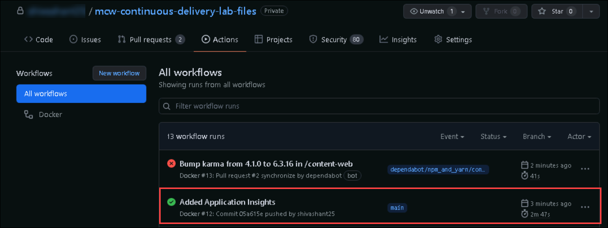

## Exercise 3: Monitoring, Logging, and Continuous Deployment with Azure

Duration: 15 minutes

Fabrikam Medical Conferences has its first website for a customer running in the cloud, but deployment is still a largely manual process, and we have no insight into the behavior of the application in the cloud. In this exercise, we will add monitoring and logging to gain insight into the application usage in the cloud. Then, we will disable the GitHub pipeline and show how to build a deployment pipeline in Azure DevOps.

### Task 1: Set up Application Insights

1. Run the below-mentioned command to deploy the app insights, make sure that you are in the correct directory:

    ```
    ./deploy-appinsights.ps1
    ```
    
1. Now save the `AI Instrumentation Key` specified in the output - we will need it for a later step.

    ```bash
    The installed extension 'application-insights' is in preview.
    AI Instrumentation Key="55cade0c-197e-4489-961c-51e2e6423ea2"
    ```

1. Using PowerShell navigate to the `./content-web` folder in your GitHub lab files repository by running the below-mentioned command.

   ```
   cd ..
   cd .\content-web
   
   ```
   
1. Now using PowerShell, execute the following command to install JavaScript support for Application Insights via NPM to the web application frontend.

    ```bash
    npm install applicationinsights --save
    ```

1. Modify the file `./content-web/app.js` to reflect the following to add and configure Application Insights for the web application frontend in the local folder. You can use `code app.js` command in Powershell to open and modify the file.

   >**Note**: Make sure to save the `app.js` file after modifying the content.

    ```js
    const express = require('express');
    const http = require('http');
    const path = require('path');
    const request = require('request');

    const app = express();

    const appInsights = require("applicationinsights");         // <-- Add these lines here
    appInsights.setup("UPDATE AI Instrumentation Key");  // <-- Make sure AI Inst. Key matches
    appInsights.start();                                        // <-- key from step 2.

    app.use(express.static(path.join(__dirname, 'dist/content-web')));
    const contentApiUrl = process.env.CONTENT_API_URL || "http://localhost:3001";

    ...
    ```

1. Add and commit changes to your GitHub lab-files repository. From the root of the repository, execute the following:

    ```pwsh
    git add .
    git commit -m "Added Application Insights"
    git push
    ```

1. Wait for the GitHub Actions for your lab files repository to complete before executing the next step.

      

1. Redeploy the web application by running the below commands:

    ```
    cd C:\Workspaces\lab\mcw-continuous-delivery-lab-files\infrastructure
    ./deploy-webapp.ps1
    ```
    
1. Visit the deployed website and check Application Insights in the Azure Portal to see instrumentation data.


Congratulation, You have completed this workshop.
-------
    
